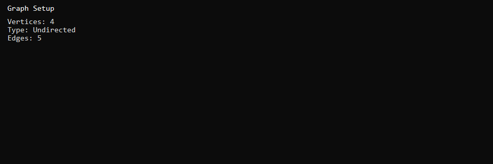
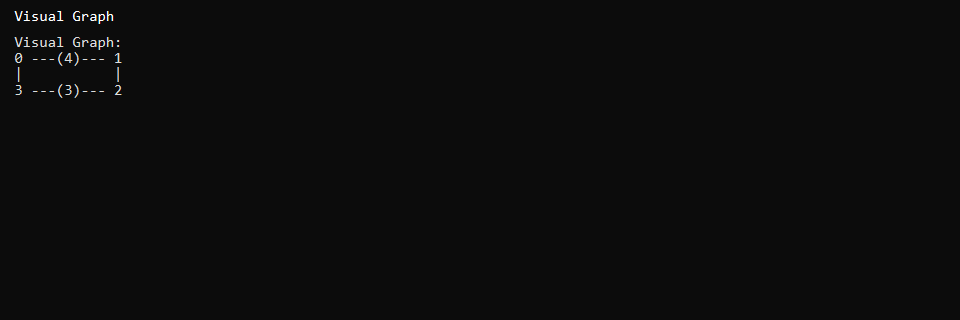
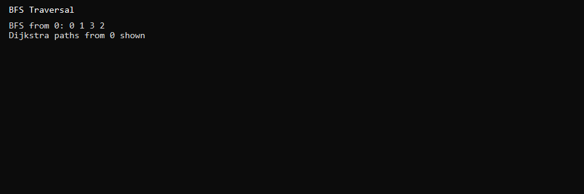

# Graph Algorithms (C++)

Menu-driven graph library implementing **BFS**, **DFS**, and **Dijkstra's shortest path** using a custom adjacency list built with doubly linked lists.

## Features

- Directed and undirected graph support
- Visual graph display and adjacency list view
- Breadth-first search (BFS) and depth-first search (DFS)
- Dijkstra shortest path with path reconstruction
- Degree info, connectivity check, and time complexity reference

## Tech Stack

- C++17
- Custom doubly linked list adjacency list
- STL: `queue`, `climits`
- Visual Studio 2022 (v143 toolset, x64)

## Screenshots







## Build and Run

1. Open `dsproject.sln` in Visual Studio 2022
2. Set configuration to **Debug | x64**
3. Build and run (F5)

Example session:
```
Vertices: 4
Type: Undirected
Edges: (0,1,4), (1,2,2), (2,3,3), (0,3,5), (1,3,1)
Menu: Visual Graph → BFS → Dijkstra from source 0
```

## Project Structure

```
dsproject/
├── dsproject/
│   └── dsproject.cpp   # Graph class + main menu
└── dsproject.sln
```

## Author

Muhammad Afzal Kalwar — [GitHub](https://github.com/mafzalkalwardev)

## License

MIT — see [LICENSE](LICENSE).
